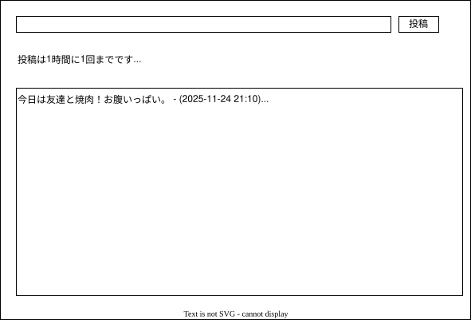

# Simple BBS

Cloudflare Workers + D1 + KV + Pagesで構築された匿名掲示板システム

## 概要

Simple BBSは一言コメントを投稿できる匿名の掲示板システムです。
Cloudflareの無料枠内で動作するように設計されています。

## 主な機能

- コメントの閲覧・投稿ができる
- スマホ・PC対応のレスポンシブデザイン

### 荒らし防止機能

- コメントは同一IPから1分に1回まで
- コメントは100文字まで
- HTMLタグ等は使えないようにする（XSS対策）
- Gemini APIに判定（rules.md）させて攻撃的なコメントは伏せ、個人情報と判断されたコメントは投稿前に警告を出して投稿を行わない

### Cloudflareの無料枠で収めるために

- frontend : Pagesで実装
- backend : Workers + D1 + KVで実装
- コメントはD1に記録、コメント一覧はKVから取得してキャッシュすることで、D1の読み込み回数を削減

## コンテンツモデレーション

Gemini APIを使用した3段階判定:

- **レベル1**: 問題なし → 投稿可能
- **レベル2**: 軽度の不適切表現 → 投稿可能（ただし「*****」といった文字列で表示し、閲覧者がクリックすることで表示可能）
- **レベル3**: 重度の不適切表現・個人情報 → 投稿拒否

詳細なルールは[moderation-rules.md](./moderation-rules.md)を参照してください。

## api設計

### GET

- KVからコメント一覧（最新100件）をJSONで取得する
- キャッシュが無い場合はD1から取得し、KVにキャッシュを保存する

### POST

- D1にコメントを追加する
- KVのキャッシュを削除する

### バッチ処理

- 1週間に1回、commentsテーブルのレコードが100件に収まるよう古いものから削除する（Workers Cron Triggersを使用）

## DB設計

### D1 SQL database

#### commentsテーブル

| カラム名 | 型 | 説明 |
|---------------|-----------|----------------------|
| id | TEXT | UUID |
| message | TEXT | コメント本文 |
| created_at | INTEGER 	| 作成日時 |
| ip_hash | TEXT | 投稿者のIPアドレスのハッシュ値 |

### Workers KV

1. コメント一覧表示用インスタンス
	- キー例：comment_cache
	- 値：最新コメントの配列（JSON）

2. 書き込み制限インスタンス
	- キー例：ip_limit:{ip_hash}
	- 値：最終書き込みタイムスタンプ（UNIX）
	- TTL：1分

## 画面設計

GETで取得したJSONをもとにコメント一覧を表示する。
あくまで画面構成であり、実際の見た目はモダンなものにする。（あとから調整しやすいようCSSファイルに分離）
